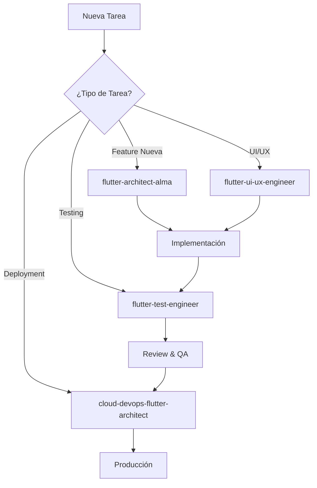

# 🤖 Guía de Agentes Especializados - Proyecto ALMA

## 📋 Tabla de Contenidos
1. [Introducción](#introducción)
2. [Agentes Disponibles](#agentes-disponibles)
3. [Invocación Manual](#invocación-manual)
4. [Invocación Proactiva](#invocación-proactiva)
5. [Guías de Contexto](#guías-de-contexto)
6. [Mejores Prácticas](#mejores-prácticas)

## 🎯 Introducción

El proyecto ALMA cuenta con agentes especializados que optimizan tareas específicas del desarrollo. Estos agentes pueden ser invocados tanto **manualmente** como **proactivamente** según las necesidades detectadas en el flujo de trabajo.

## 🛠️ Agentes Disponibles

### 1. **flutter-test-engineer** 🧪
**Especialización:** Creación de tests automatizados para Flutter

**Capacidades:**
- Tests unitarios, de widgets e integración
- Generación de mocks y stubs
- Cobertura de casos edge
- Seguimiento de mejores prácticas de testing Flutter

**Cuándo se activa proactivamente:**
- Después de implementar nuevas funcionalidades
- Al crear BLoCs, Cubits o repositorios
- Cuando se modifican widgets complejos
- Al refactorizar código crítico

### 2. **flutter-ui-ux-engineer** 🎨
**Especialización:** Diseño e implementación de interfaces de usuario

**Capacidades:**
- Creación de pantallas y componentes
- Diseño responsive y adaptativo
- Implementación de accesibilidad
- Optimización de rendimiento UI
- Coordinación con capas del sistema

**Cuándo se activa proactivamente:**
- Al crear nuevas pantallas o vistas
- Cuando se requieren mejoras de UX
- Para implementar diseños responsive
- Al optimizar rendimiento visual

### 3. **cloud-devops-flutter-architect** ☁️
**Especialización:** CI/CD, deployment y arquitectura cloud

**Capacidades:**
- Configuración de pipelines CI/CD
- Estrategias de deployment
- Evaluación de hosting providers
- Planes de despliegue con monitoreo
- Procedimientos de rollback

**Cuándo se activa proactivamente:**
- Al configurar automatización de builds
- Cuando se requiere deployment
- Para optimizar pipelines existentes
- Al planificar releases

### 4. **flutter-architect-alma** 🏗️
**Especialización:** Arquitectura del proyecto ALMA

**Capacidades:**
- Diseño siguiendo Clean Architecture
- Estructura de módulos y dependencias
- Configuración de inyección de dependencias
- Estrategias de testing
- Integración del stack tecnológico

**Cuándo se activa proactivamente:**
- Al añadir nuevas features complejas
- Cuando se requiere refactoring arquitectural
- Para revisar cumplimiento de patrones
- Al integrar nuevas tecnologías

## 🎮 Invocación Manual

### Comandos de Activación Directa

Para invocar un agente específico, usa estas palabras clave al inicio de tu mensaje:

| Agente | Palabras Clave de Activación |
|--------|------------------------------|
| flutter-test-engineer | `test`, `testing`, `pruebas` |
| flutter-ui-ux-engineer | `diseñador`, `ui`, `ux`, `interfaz` |
| cloud-devops-flutter-architect | `devops`, `deploy`, `ci/cd`, `pipeline` |
| flutter-architect-alma | `arquitectura`, `arquitecto`, `estructura` |

### Ejemplos de Invocación Manual

```plaintext
Usuario: "diseñador necesito una pantalla de login atractiva"
→ Activa: flutter-ui-ux-engineer

Usuario: "test crea pruebas para el AuthBloc"
→ Activa: flutter-test-engineer

Usuario: "devops configura GitHub Actions para el proyecto"
→ Activa: cloud-devops-flutter-architect

Usuario: "arquitectura revisa si GameBloc sigue Clean Architecture"
→ Activa: flutter-architect-alma
```

## 🤖 Invocación Proactiva

### Criterios de Activación Automática

Los agentes se activan automáticamente cuando se detectan estos patrones:

#### **flutter-test-engineer** se activa cuando:
```plaintext
✓ Se completa implementación de nueva funcionalidad
✓ Se crea un BLoC/Cubit/Repository/Service
✓ Se modifica lógica de negocio crítica
✓ El usuario pide "asegurar calidad del código"
```

#### **flutter-ui-ux-engineer** se activa cuando:
```plaintext
✓ Se requiere crear/modificar pantallas
✓ Se mencionan componentes visuales
✓ Se habla de experiencia de usuario
✓ Se requiere diseño responsive
✓ Se optimiza rendimiento visual
```

#### **cloud-devops-flutter-architect** se activa cuando:
```plaintext
✓ Se menciona deployment o despliegue
✓ Se requiere configurar CI/CD
✓ Se habla de hosting o servidores
✓ Se planifica un release
✓ Se requiere monitoreo
```

#### **flutter-architect-alma** se activa cuando:
```plaintext
✓ Se añade una feature compleja nueva
✓ Se requiere estructurar módulos
✓ Se revisa arquitectura existente
✓ Se integra nueva tecnología
✓ Se refactoriza estructura del proyecto
```

## 📝 Guías de Contexto

### Contexto Esencial para Cada Agente

#### Para **flutter-test-engineer**:
```markdown
- Código a testear (clase/función/widget)
- Dependencias y mocks necesarios
- Casos de uso específicos
- Nivel de cobertura deseado
- Framework de testing usado (si existe)
```

#### Para **flutter-ui-ux-engineer**:
```markdown
- Propósito de la UI
- Usuarios objetivo (niños en ALMA)
- Plataformas target (Android/iOS/Web)
- Componentes existentes para reutilizar
- Requisitos de accesibilidad
- Estado actual del diseño
```

#### Para **cloud-devops-flutter-architect**:
```markdown
- Plataformas de deployment target
- Presupuesto y recursos disponibles
- Requisitos de escalabilidad
- Estrategia de versionado
- Necesidades de monitoreo
- Políticas de seguridad
```

#### Para **flutter-architect-alma**:
```markdown
- Feature a implementar
- Módulos afectados
- Patrones arquitecturales actuales
- Stack tecnológico (bloc, go_router, etc.)
- Restricciones del proyecto
- Objetivos de escalabilidad
```

## 🎯 Mejores Prácticas

### 1. **Proporciona Contexto Completo**
```plaintext
❌ MAL: "Crea tests"
✅ BIEN: "Crea tests para el ColorGameBloc que maneja la lógica del juego de colores"
```

### 2. **Especifica Requisitos Claros**
```plaintext
❌ MAL: "Mejora la UI"
✅ BIEN: "Mejora la UI del menú principal haciéndola más intuitiva para niños de 4-6 años"
```

### 3. **Permite Invocación Proactiva**
```plaintext
Cuando implementes código nuevo, el sistema detectará automáticamente si necesitas:
- Tests (después de crear funcionalidad)
- UI/UX (al trabajar con interfaces)
- DevOps (al preparar releases)
- Arquitectura (al estructurar features)
```

### 4. **Combina Agentes Cuando Sea Necesario**
```plaintext
Ejemplo de flujo completo:
1. flutter-architect-alma → Diseña estructura de nueva feature
2. flutter-ui-ux-engineer → Implementa las pantallas
3. flutter-test-engineer → Crea tests completos
4. cloud-devops-flutter-architect → Prepara deployment
```

## 🔄 Flujo de Trabajo Recomendado



## 💡 Tips Avanzados

### Invocación en Cadena
Puedes planificar el uso de múltiples agentes:
```plaintext
"Necesito implementar el juego de memoria: primero diseña la arquitectura, 
luego la UI, y finalmente crea tests completos"
```

### Contexto Persistente
El sistema mantiene contexto entre invocaciones:
```plaintext
Usuario: "arquitectura diseña el módulo de puzzles"
[Agente diseña arquitectura]
Usuario: "ahora implementa la UI"
[Se activa flutter-ui-ux-engineer con contexto previo]
```

### Revisión Cruzada
Los agentes pueden revisar el trabajo de otros:
```plaintext
"flutter-architect-alma revisa si la UI implementada sigue los patrones definidos"
```

## 📊 Métricas de Éxito

Los agentes optimizan para:
- **Calidad del código** (arquitectura limpia, tests robustos)
- **Experiencia de usuario** (interfaces intuitivas y accesibles)
- **Eficiencia del desarrollo** (automatización, CI/CD)
- **Mantenibilidad** (estructura escalable, documentación)

## 🚀 Actualización Continua

Este documento se actualiza cuando:
- Se añaden nuevos agentes
- Se mejoran capacidades existentes
- Se descubren nuevos patrones de uso
- La comunidad propone mejoras

---

**Última actualización:** 2025-08-09
**Versión:** 1.0.0
**Proyecto:** ALMA - Aprendizaje y Lógica para Mentes Activas